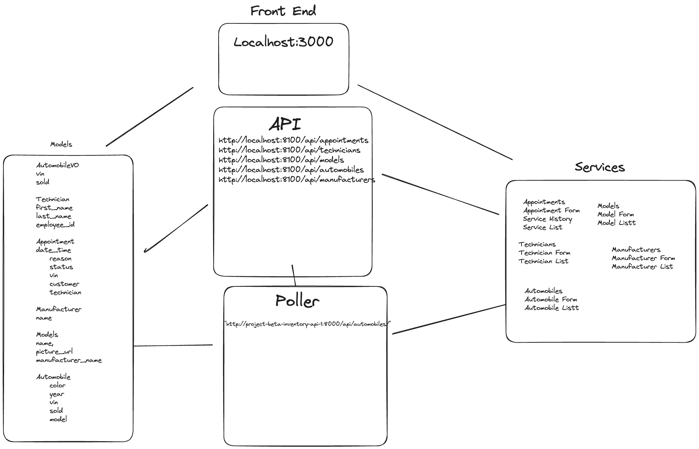

# CarCar

Team:

* Person 1 - Ralphy Service
* Person 2 - Martin Maldonado Auto Sales

## Design
 Sales Desgin -  The value objects are writtine in inventory api and the sales api
 under their respective models.
 
## Service microservice

Explain your models and integration with the inventory
microservice, here.

## Sales microservice

Explain your models and integration with the inventory
microservice, here.

Made a directory in my terminal.  I then forked and cloned the git url and placed it into that directory.

built and ran a project in Docker, inside that same directory, which allowed me to open up my containers

the rest is the explaination of what I did in this project.  Most are in order in how I did it.  

The inventory microservice is made up of three models
    -Manufacuturer, Vehiclemodel, and Automobile. (this is in sequential order in what needs to come from what)
There are connected to API endpoints that allow us to POST and GET the data it is storing.  

    ALL HAVE A PORT OF 8100 TO THE HOST MACHINE.  THIS WAS THE PORT TO COMMUNICATE TO THE INVENTORY-API
    -List manufacturers	GET	http://localhost:8100/api/manufacturers/
    -Create a manufacturer	POST	http://localhost:8100/api/manufacturers/
    -List vehicle models	GET	http://localhost:8100/api/models/
    -Create a vehicle model	POST	http://localhost:8100/api/models/
    -Get a specific vehicle model	GET	http://localhost:8100/api/models/:id/
    -etc.....
These are also rendered on the front end using those same endpoints in their respected .js files.

We take that information we we will use it as a base to start the sales app.  Since it is
a seperate app, we will need complete the automobile poller in order to recieve the data we need>
That code is below:
def get_automobiles():
    response = requests.get("http://project-beta-inventory-api-1:8000/api/automobiles/")
    content = json.loads(response.content)
    print(content)
    for auto in content["autos"]:
        auto_vo, created = AutomobileVO.objects.update_or_create(
            vin=auto["vin"],
            defaults={
                'sold': auto["sold"]
            }
the print(content) is a tool to use to show what you are polling from
the database.  It printed in my terminal, but would also print in the
corresponding container in DOCKER.

    Docker is used to simulate different data-bases and enviorments through containers.
    There are 7 containers in this project. The code above is meant to pull from inventory
    and into sales app.  
    

    DOCKER CONTAINERS ALL HAVE A SPECIFIC PORT NUMBER IN ORDER TO COMMUNICATE WITH THAT CONTAINER.  
    THEY CAN BE FOUND IN DOCKER-COMPOSE.YML FILE.  THEY ARE THEY ONES ON THE RIGHT SIDE OF THE COLON
    THE NUMBERS ARE ON THE LEFT ARE FOR THE PORT FOR THE HOST 
        ports:
      - "8090:8000" sales/customers/salespeople
      - "8080:8000" service api
      -- "8100:8000" autmobiles/manufacturers
      - "3000:3000" local host

There is some stuff missing like the imports, but this should be the meat of it>

From this poller we can create the AutomobileVO that will take care of the data for the vin
of the vehicles, we will use that later...

Next we create the models for the sales APP which are the Salesperson, Customer, Sale, and AutomobileVO
These models are the machine that creates the data that will will input. We will also need the views that
will make that information visible to the client, as well as a path to get ther in the urls.py.
The views consist of a POST - the ability to create, and a GET  - a list of data.  Also, these views will
have detailencoders with properties of what data we want to pull from the models.  These views need to have
what model they are pulling from and what they are pulling from in those models.

i.e.
@require_http_methods(["GET", "POST"])
def api_sale(request):
    if request.method == "GET":
        sales = Sale.objects.all()
        return JsonResponse(
            {"sales": sales},
            encoder=SalesEncoder,
            safe=False,
        )
    else:
        content = json.loads(request.body)
        try:
            automobile = AutomobileVO.objects.get(vin=content['automobile'])
            salesperson = Salesperson.objects.get(employee_id=content['salesperson'])
            customer = Customer.objects.get(first_name=content['customer'])
            sale = Sale.objects.create(
                price=content['price'],
                automobile=automobile,
                salesperson=salesperson,
                customer=customer
            )
            return JsonResponse(
                sale,
                encoder=SalesEncoder,
                safe=False)
        except Exception as e:
            return JsonResponse({"message": str(e)}, status=400)

One that is created, I went ahead and created the endpoints to test to see if these
models and views are creating what I needed.

    ALL THE PARAMETERS ARE DICTACTED BY THEIR RESPECTED MODELS
    ALL HAVE THE PORT 8090, MEANING THAT THIS THE PORT NUMBER THAT IT MUST GO THROUGH ON THE HOST MACHINE.
    POST http://localhost:8100/api/automobiles/
    {
	
  "color": "blue",
  "year": 2012,
  "vin": "1C4RJFBGXFC788391",
  "model_id": "7"

}
    GET http://localhost:8100/api/automobiles/
    
	"autos": 
		{
			"href": "/api/automobiles/1C3CC5FB2AN120174/",
			"id": 1,
			"color": "red",
			"year": 2012,
			"vin": "1C3CC5FB2AN120174",
			"model": {
				"href": "/api/models/1/",
				"id": 1,
				"name": "Sebring",
				"picture_url": "https://upload.wikimedia.org/wikipedia/commons/thumb/7/71/Chrysler_Sebring_front_20090302.jpg/320px-Chrysler_Sebring_front_20090302.jpg",
				"manufacturer": {
					"href": "/api/manufacturers/1/",
					"id": 1,
					"name": "Chrysler"
				}
			},
			"sold": false
		},
    Here are the 
    List salespeople GET	http://localhost:8090/api/salespeople/ - returns a list of the sales people which is created by the SalesPeople model
    {
	"salespeople": [
		{
			"id": 6,
			"first_name": "James",
			"last_name": "Singer",
			"employee_id": 12345
		},
		{
			"id": 7,
			"first_name": "test",
			"last_name": "Maldonado",
			"employee_id": 1234
		}
	]
}

    Create a salesperson	POST	http://localhost:8090/api/salespeople/ creates the List of salespeople
    {
	"first_name": "Luis",
	"last_name": "Ralphy",
	"employee_id": "1235"
}

    List customers	GET	http://localhost:8090/api/customers/ list the customers created by the api below
    {
	"customer": [
		{
			"id": 8,
			"first_name": "Martin",
			"last_name": "Maldonado",
			"address": "1701 NW 56th St",
			"phone_number": "8157158485"
		}
	]
}
    Create a customer	POST	http://localhost:8090/api/customers/ 
    {
	"first_name": "Jane",
	"last_name": "Doe",
	"address": "300 Jefferson Dr.",
	"phone_number": "1234567890"
}

    List sales	GET	http://localhost:8090/api/sales/ creates a sale, needs info from AutomobileVO, Salersperson model,
    
	"sales": 
		{
			"id": 12,
			"price": "5.00",
			"automobile": {
				"sold": false,
				"vin": "1C3CC5FB2AN120134",
				"id": 16
			},
			"salesperson": {
				"id": 7,
				"first_name": "test",
				"last_name": "Maldonado",
				"employee_id": 1234
			},
			"customer": {
				"first_name": "test",
				"last_name": "test",
				"address": "test",
				"phone_number": "test"
			}
		},
		{
			"id": 13,
			"price": "5.00",
			"automobile": {
				"sold": false,
				"vin": "1C3CC5FB2AN120138",
				"id": 17
			},
			"salesperson": {
				"id": 7,
				"first_name": "test",
				"last_name": "Maldonado",
				"employee_id": 1234
			},
			"customer": {
				"first_name": "test",
				"last_name": "test",
				"address": "test",
				"phone_number": "test"
			}
		},
    Custer Model, all are ForeiegnKeys in the Sale model
    Create a sale	POST	http://localhost:8090/api/sales/
    {
	"price": "25000",
	"automobile": "1C3CC5FB2AN120134",
	"salesperson": "1234",
	"customer": "John"
}

once I tested these in insomnia.  Used a json body to input a POST,
and then the information was in the GET request.  Showing that my models,
views, and api endpoints are correct.

After this I move onto the front end in order to create a format that will
display my GET and POST requests that I made. 

React works like this.  index.js is the structure, app.js has the big information to connect it all, 
and the Nav.js is a way to navigate it all.  I created .js files for the different GET and POST requests
creating list and forms, which are just client interfaces that do the same thing you do in the backend.
Each page had and api endpoint that it was pulling from, that had to match what was in the backend(views/models).
The .js files are componets or functions that you input the information from the backend and return jsx that is
visible by the client.  

The rest is format the return statment how you want it.  Double check to see your forms and list work
on the the front end.  Make sure your branch is stable and push/merge with main.  From there you 
add., commit, and push to git.  

